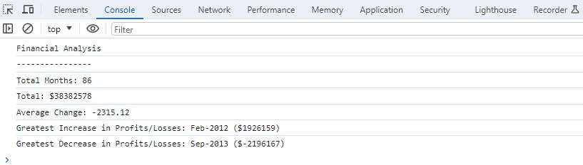
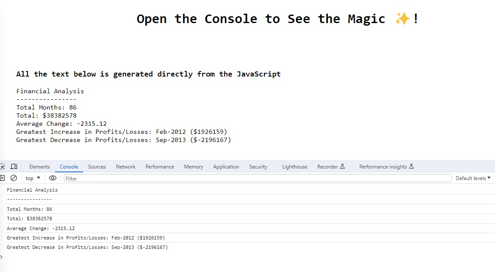

# Console-Finances
Unit 4 Challenge: Console Finances

Analyse the Data and Display the results to the console. 

## User Requirements
Analysis needs to output the following...
1) Total Number of Months.
2) Total net Profit or Loss.
3) Average Monthly Change.
4) Greatest Increase In Profits.
5) Greatest Loss in Any Individual Month.

## Problems solved
1) Accesing nested arrays, That was a challenge.
2) Looping through the months and auto-generating a new array of monthly changes.
3) Once I'd found the Greatest Increase & Decrease, then displaying it with it's corresponding month.
4) Getting the Math.Round() function working took some research. 
5) DRY code, original code contains 3 for loops, which can be condessed ino one. 

## Hosted Site:
https://deanw77.github.io/Console-Finances/

### Project Overview

A very enjoyable project. I initially had some difficulty figuring out how to access each of the elements in the nested array (Getting only the Date or the Profit/Loss figure). Calculating the Average Change was the biggest challenge. 
I initially solved each problem individually, each with it's own loops but after decided that since I had three loops all running with identical coditional statements it would be better practice to put it into one loop so as not to repeat code. 
I have commented out my initial three loops so I can see from the code firstly how I solved each problem then how I reduced the number of loops. 

### Final Result

### The search for bonus points
I then decided to practice getting data from the JavaScript console and displaying it directly on the HTML page. What I have is possibly not the most elegant solution to achieve this, but itworks and prodices no errors.

